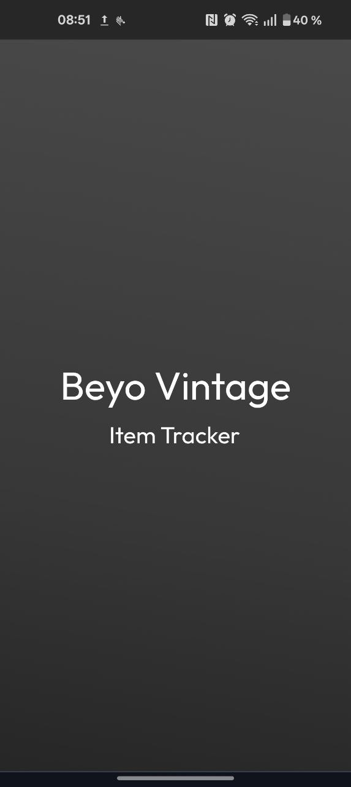
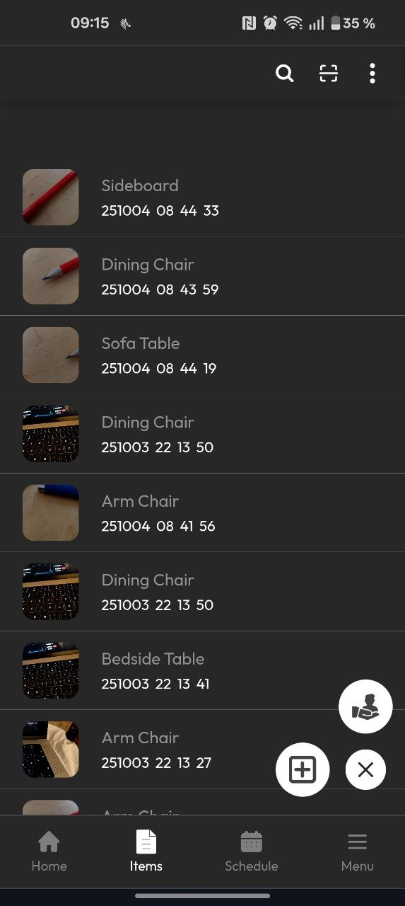
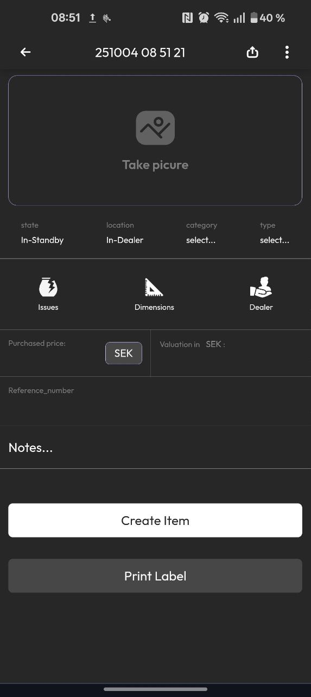
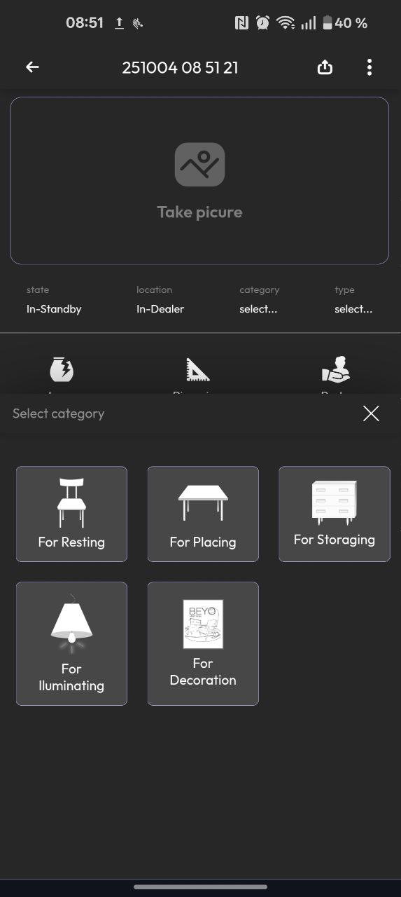
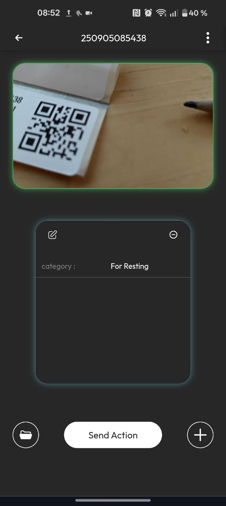

# Inventory CRM – Frontend (React + TypeScript)

This is the frontend of the Inventory CRM system built for internal company use.  
It allows users to manage inventory, deliveries, and warehouse items through a responsive, mobile-friendly interface.

---

## 🚀 Features
- Add and edit inventory items
- Upload multiple images to AWS S3
- Generate and print QR code labels
- Scan barcodes and QR codes
- Offline support (PWA)
- Real-time form validation and smooth UI

---

## 🧰 Tech Stack
- **React** (TypeScript)
- **Vite / Create React App** (depending on your setup)
- **Axios / Fetch API** for backend communication
- **AWS S3** for image storage

---

## Why this crm ?

The company I made this application is a growing second hand store, their items have unique properties and are track in different ways, thus it was hard for them to use standar crms, which are mostly made for mass production. 

To modify the Item types, properties, and issues, you can look at the folder src/maps. Check the components that use these maps to build the UI, so that you can make your own items, properties and issues. 

### PropertySelection
**Path :** src/Components/Item_Components/PropertySelection.tsx.

**Role :** in charge of rendering the button that triggers the slide popup

### DynamicBoxesV2
**Path :** src/Components/Item_Components/DynamicBoxesV2.tsx

**Role :** In charge of building the interactive buttons and to label the user selection in to the item dictionary


# Screenshots

### LoginPage
<div style="display: flex; flex-direction: row; gap: 10px;">
  

</div>

### Main Inventory Page
<div style="display: flex; flex-direction: row; gap: 10px;">
  

</div>


### Add Item Form

<div style="display: flex; flex-direction: row; gap: 10px;">
  
  

</div>


### Scann Page
<div style="display: flex; flex-direction: row; gap: 10px;">
  

</div>

### Filter Page
<div style="display: flex; flex-direction: row; gap: 10px;">
  

</div>


### ⚙️ Setup Instructions

```bash
# Clone the repository
git clone https://github.com/Loorenz-David/Beyo_App_React

# Navigate to the project folder
cd inventory-crm-frontend

# Install dependencies
npm install

# Start development server
npm run dev

---
```

## Backend Connection
# The frontend communicates with the Flask backend API.
Make sure the backend is running and update the API base URL in your environment file:

Flask API repository:
 https://github.com/Loorenz-David/Beyo_App_Flask

## ViteConfig adjusments
 You will need to add the Back end ip to the viteconfig.ts file:  
 ```ts
 config.server = {
      host:true,
      proxy:{
        '/api':{
          target:'https://127.0.0.1:5001',
          changeOrigin:true,
          secure:false}
      }

    }
```

