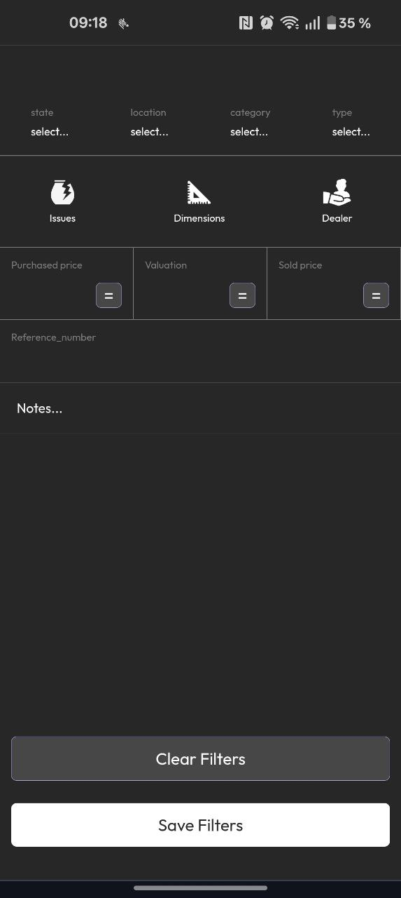

# Inventory Manager Front End

[](https://react.dev/)
[](https://www.typescriptlang.org/)
[](https://vitejs.dev/)
[](LICENSE)
[](https://vercel.com/)

## Introduction

**Inventory Manager Front End** is a dynamic, mobile-inspired web application for managing inventory items. Designed for speed, flexibility, and offline capability, it empowers users to add, track, and batch-edit items, print labels via Bluetooth Zebra printers, scan QR codes, and more—all with a seamless, app-like experience.

---

## Features

- **Dynamic Item Management:** Add, edit, batch update, and filter items using intuitive selection boxes with icons.
- **Fast Item Creation:** Use a slider to trigger pop-ups in order for rapid property entry.
- **Label Printing:** Print item labels directly to Zebra printers via Bluetooth.
- **Offline Support:** PWA-enabled with service workers and IndexedDB for storing thousands of items (including images) offline.
- **Batch Actions:** Perform bulk operations on items efficiently.
- **QR Code Scanning:** Scan items to view or modify properties, or trigger batch actions using HTMLQRCODE scanner.
- **Camera Controls:** Live camera components with flashlight and lens switching options.
- **Advanced Filtering:** Filter items by any property, including numerical comparisons (equal, greater than, less than).
- **Consistent UI/UX:** Unified components for all item operations—creation, editing, batch editing, offline actions, and filtering.
- **Mobile-Style Navigation:** Swipe right/left to navigate between pages, with multi-page memory (iPhone-like).
- **Dynamic Messaging:** All app/server messages handled by a single, expandable message box component with contextual color and icons.
- **API-Driven:** All backend operations via JSON API calls to a Flask/SQLAlchemy backend.
- **PWA Experience:** Installable, offline-ready, and feels like a native app.

---


## Screenshots & Demo

### LoginPage
<div style="display: flex; flex-direction: row; gap: 10px;">
  

</div>

### Main Inventory Page
<div style="display: flex; flex-direction: row; gap: 10px;">
  

</div>


### Add Item Form

<div style="display: flex; flex-direction: row; gap: 10px;">
  
  

</div>


### Scann Page
<div style="display: flex; flex-direction: row; gap: 10px;">
  

</div>

### Filter Page
<div style="display: flex; flex-direction: row; gap: 10px;">
  

</div>


## Tech Stack

- **Frontend:** [React](https://react.dev/), [Vite](https://vitejs.dev/), [TypeScript](https://www.typescriptlang.org/)
- **APIs:** Google API, BrowserPrint
- **Backend:** [Flask Backend API](https://github.com/your-backend-repo) (see backend repo for endpoint details)
- **Deployment:** [Vercel](https://vercel.com/)

---

## Getting Started

### Prerequisites

- Node.js (v16+ recommended)
- npm or yarn

### Setup Instructions

1. **Clone the repository**
    ```bash
    git clone https://github.com/your-org/inventory-manager-frontend.git
    cd inventory-manager-frontend
    ```

2. **Install dependencies**
    ```bash
    npm install
    # or
    yarn install
    ```

3. **Run the development server**
    ```bash
    npm run dev
    # or
    yarn dev
    ```

4. **Build for production**
    ```bash
    npm run build
    # or
    yarn build
    ```

---

## Folder Structure
src/
  ├── assets/                # SVGs, icons, images
  ├── Components/            # Modular React components
  │   ├── Menu_Components/   # User, item, and menu logic
  │   ├── Page_Components/   # Page navigation and transitions
  │   ├── Loader_Components/ # Loading indicators
  ├── contexts/              # React context providers (data, slide pages, messages)
  ├── hooks/                 # Custom hooks (fetch, upload, slide page touch, etc.)
  ├── types/                 # TypeScript type definitions
  ├── App.tsx                # Main app entry
  └── main.tsx               # Vite entry point
public/
  ├── manifest.json          # PWA manifest
  └── service-worker.js      # Service worker for offline support

---

## Environment Variables

Create a `.env` file in the project root for any required environment variables. Example:

```env
VITE_API_BASE_URL=https://your-api-url.com
VITE_GOOGLE_API_KEY=your-google-api-key
```

## API Endpoints
All backend operations are performed via RESTful API calls.
For details on available endpoints, request/response formats, and authentication, please refer to the [Flask Backend API repository]().

## Deployment
This project is deployed on Vercel.
To deploy your own version, connect your repository to Vercel and follow their deployment instructions.

## ⚙️ Connecting Frontend to Flask Backend (Local Development)

To enable communication between the Vite frontend and the Flask API, you need to configure the development proxy inside your vite.config.ts file.

This ensures that API requests made from the frontend (to /api/...) are automatically redirected to your local Flask server during development.


Make sure your file includes the following under config.server:
```ts
server: {
  host: true,
  proxy: {
    '/api': {
      target: 'https://127.0.0.1:5001', // Flask backend URL
      changeOrigin: true,
      secure: false,
    },
  },
},
```
💡 Tip:
If your Flask server runs on HTTP instead of HTTPS, change the target to:

``` ts
target: 'http://127.0.0.1:5000'
```

 ### Add HTTPS for Localhost (Optional)

 ```ts 
 import fs from 'fs';

server: {
  https: {
    key: fs.readFileSync('./localhost+1-key.pem'),
    cert: fs.readFileSync('./localhost+1.pem'),
  },
}
```

### Run both servers

- start the Flask Servers

```bash
flask run --host=127.0.0.1 --port=5001
```

- Start the Vite frontend:
```bash
npm run dev
```

You can now send request like:

```js 
fetch('/api/items')
```

and Vite will automatically forward them to your Flask backend.


## Credits
- Built with the help of GitHub Copilot and ChatGPT.
- Special thanks to the company supporting this project for their vision and resources.


## Linces
- Free license—use, modify, and share as you wish!

## Contributing
Pull requests and suggestions are welcome!
Please open an issue or contact the maintainer for major changes.

## Contact
For questions or support, please reach out via GitHub Issues.